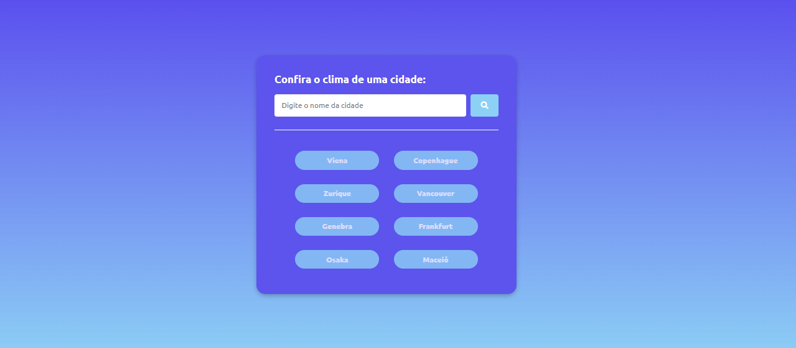

# API Clima Mundial

## Instruções

1. Navegue até https://openweathermap.org/  no seu perfil vá em `Minhas chaves de Api`.
2. Copie sua chave e adicione no campo `const apiKey = "adicione o valor aqui";`.
3. Fim!

    

    

    

## Tecnologias 

  
  
  

